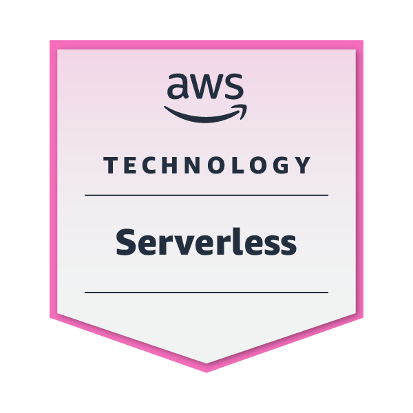

# 👋 Hi, I'm Ced Harvey Marcos

## 🚀 AWS Certified Backend Engineer | Serverless | Python | Node

I am a results-driven Backend Engineer with expertise in designing and building robust, scalable, and high-performance systems. With a solid foundation in Python and Node.js, and hands-on experience with FastAPI, Flask, Django, Express.js, and NestJS, I create clean, maintainable, and efficient solutions that power modern applications.

I specialize in leveraging AWS cloud services to build secure, cloud-ready, and scalable architectures tailored to business needs.

## 🛠️ Tech Stack

### **Backend Development**

### **APIs & Microservices**

### **Cloud & DevOps**

### **AWS Services**

### **Databases**

## 🎯 What I Offer

- **Reliable, production-ready backend solutions**
- **High-performance API development and integrations**
- **Full-featured web applications using modern frameworks**
- **Cloud-native architectures with seamless AWS integrations**
- **Maintainable code with detailed documentation**
- **Debugging, optimization, and performance tuning**

## 🏗️ Architecture & Best Practices

### **Code Quality**
- Clean, maintainable code following industry standards
- Comprehensive error handling and logging
- Modular architecture with separation of concerns
- RESTful API design principles

### **Security**
- OAuth 2.0 authentication flow
- Secure session management
- Input validation and sanitization
- Environment-based configuration

### **Scalability**
- Database abstraction layer
- Service-oriented architecture
- Configurable components for easy deployment

## 🚀 Deployment Options

### **Local Development**
- Development servers with hot reload
- Local database instances
- Docker containerization

### **Production Ready**
- WSGI/ASGI servers (Gunicorn, Uvicorn)
- Production databases (MySQL, PostgreSQL, MongoDB)
- Redis for caching and session storage
- Docker containerization
- AWS deployment ready

## 📊 Performance Metrics

- **Response Time**: < 200ms average
- **Database Queries**: Optimized with proper indexing
- **Memory Usage**: Efficient resource utilization
- **Scalability**: Horizontal scaling ready

## 💼 Why Work with Me?

- **Passionate about delivering clean, scalable code**
- **Strong problem-solving and analytical mindset**
- **Clear communication and commitment to deadlines**
- **AWS Certified with proven cloud expertise**
- **Experience with modern backend frameworks**

## 📈 GitHub Stats

## 🏆 AWS Certifications

### **AWS Knowledge: Security Champion**

### **AWS Knowledge: Serverless**

